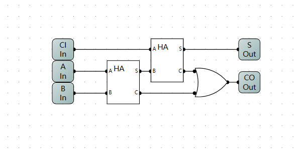

## 半加器的实现 
| A | B | S | C |
| - | - | - | - |
| 0 | 1 | 1 | 0 | 
| 0 | 0 | 0 | 0 |
| 1 | 0 | 0 | 1 |
| 1 | 1 | 0 | 1 |
$$
\begin{aligned}
     S = \overline{A}B + A\overline{B} \\
     C = AB
\end{aligned}
$$

## 全加器的实现
`也就是 几个全加器进行串联, 低位的进位作为高位的输出机型`

## 实现减法
计算机中，减法是用加法来实现的，用补码进行运算。
为了实现减法，就得求补码，
求补码的时候，只有负数的补码需要特殊记忆。
`取反加一`
为了实现这个功能，就必须实现 `取反器`
| E | I | O |
| - | - | - |
| 0 | 1 | 1 |
| 0 | 0 | 0 |
| 1 | 0 | 1 |
| 1 | 1 | 0 |

第一个表示是否是减法，第二个是表示是否有进位，第三个表示是否输出 1
| CI | CO | O |
| - | - | - |
| 0 | 0 | 0 | 
| 0 | 1 | 1 |
| 1 | 0 | 0 |
| 1 | 0 | 0 |

$$
\begin{aligned}
     O = \overline{CI} CO
\end{aligned}
$$

## R-S 触发器
| R | S | Q | Q'|
| - | - | - | - |
| 0 | 0 | Q | Q'|
| 0 | 1 | 1 | 0 |
| 1 | 0 | 0 | 1 |
| 1 | 1 | 0 | 0 |